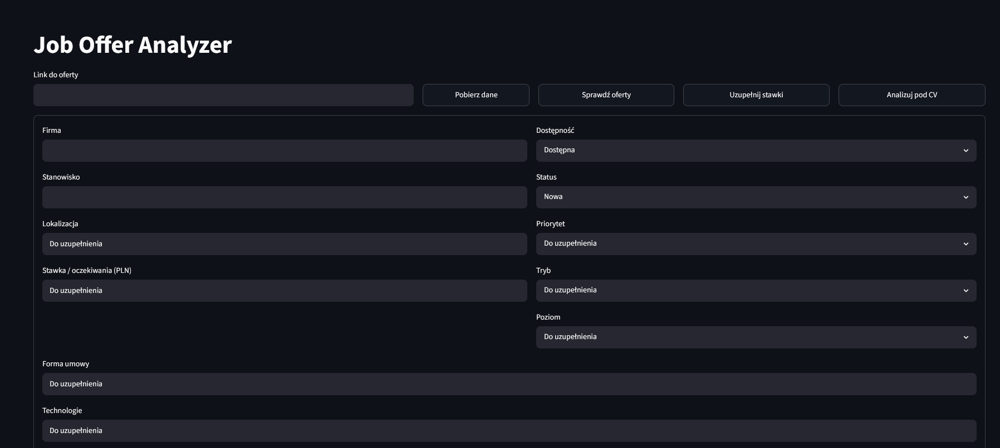
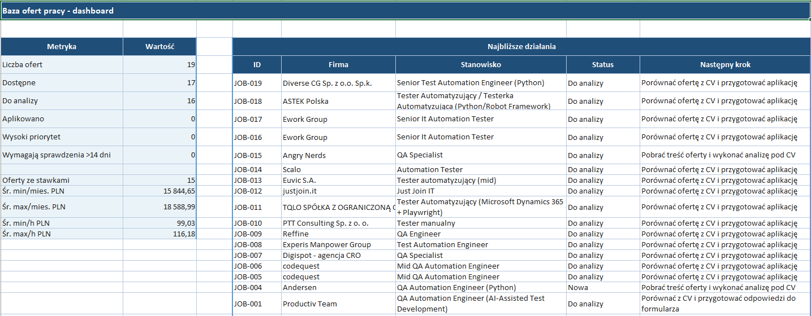
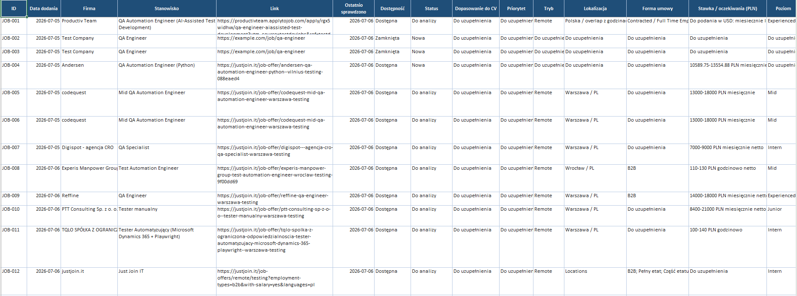
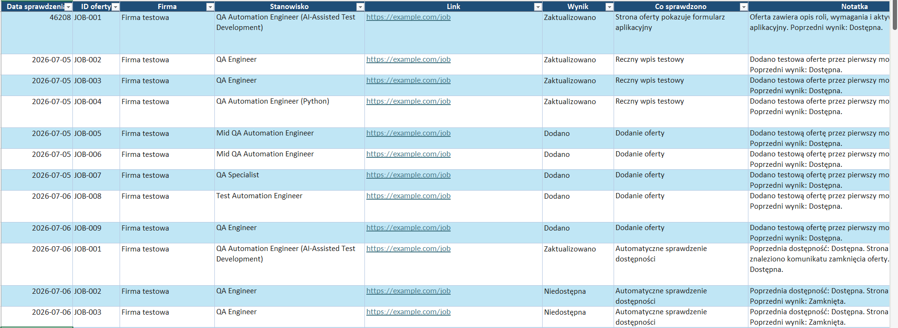

# Job Offer Tracker

Job Offer Tracker is a local tool for collecting, organizing, and reviewing QA/IT job offers. It extracts data from job posting URLs, lets the user correct the extracted information, stores everything in an Excel workbook, and keeps the application process easier to track.

The project combines Python, lightweight UI development, Excel automation, web scraping, data organization, and AI-assisted development practices.

## Why This Project Was Created

The project was created to solve a real workflow problem. Manually browsing job offers, copying details, comparing requirements, checking salaries, and remembering the status of each application was time-consuming and error-prone.

Instead of managing everything manually in a spreadsheet, I wanted to automate the repetitive parts of the process. This application was not created only as a portfolio exercise. It was built as a practical tool for collecting, updating, and analyzing job offers in one place.

## How The Application Works

Basic workflow:

1. The user pastes a job offer URL.
2. The application fetches data from the job posting page.
3. The extracted data is displayed in a Streamlit form.
4. The user can manually correct or complete the data.
5. The application saves the record to an Excel workbook.
6. Existing offers can be updated instead of duplicated.
7. A change history is saved in a separate worksheet.
8. The Excel dashboard is refreshed based on the current offer data.

Excel acts as both a local database and a reporting layer. This keeps the MVP simple to run while still making the data easy to filter, review, and analyze.

The code uses English technical keys internally, while the Excel workbook uses Polish worksheet and column names because it is the user-facing reporting layer.

## Project Architecture

Main application areas:

- **UI (Streamlit)** - provides a local browser interface for pasting URLs, reviewing extracted data, correcting the form, and saving offers.
- **Job offer parser** - fetches job posting pages and extracts useful information from HTML and structured data.
- **Business logic layer** - handles application rules such as duplicate detection, statuses, priorities, availability checks, and action history.
- **Excel persistence layer** - writes and updates workbook data, keeps worksheet tables consistent, and preserves compatibility with existing files.
- **Dashboard** - summarizes saved offers and upcoming actions directly in Excel.

## Tech Stack

- **Python** - core language for the application and business logic.
- **Streamlit** - local UI for working with job offers in the browser.
- **OpenPyXL** - reading, writing, formatting, and maintaining Excel workbooks.
- **Requests** - fetching job posting pages.
- **BeautifulSoup** - parsing HTML and extracting content from job offers.
- **Git** - version control.
- **GitHub** - remote repository and project presentation.
- **AI-assisted development (Codex / GitHub Copilot)** - support for planning, implementation, refactoring, and documentation.

## Key Features

### Currently Available

- fetch job offer data from a URL
- review and correct extracted data before saving
- save offers to the `Oferty` worksheet
- detect duplicate offers by URL
- update existing offers
- extract and normalize salary information
- detect the job portal based on URL
- maintain action and availability history
- refresh the Excel dashboard
- run basic non-generative CV matching

### Planned Development

- improved CV matching
- AI-based job offer analysis
- market trends dashboard
- report export
- better support for multiple job portals
- Excel validation lists for selected fields

## Roadmap

- ✅ Fetch job offer data from URLs
- ✅ Form for manual correction
- ✅ Save data to Excel
- ✅ Update existing offers
- ✅ Dashboard
- ✅ Change history
- 🔄 CV analysis
- 🔄 AI insights
- 🔄 Market trends analysis
- 🔄 Report export

## Excel Data Structure

Main worksheets:

- `Oferty` - current job offer list and process status
- `Analiza_CV` - analysis of job requirements against the candidate profile
- `Historia_Sprawdzen` / `Historia_Sprawdzeń` - action log for added, updated, unavailable, or duplicate offers
- `Pytania_Formularzy` - place for application form questions
- `Dashboard` - summary and next actions

Important reporting columns in `Oferty`:

- `Wynik dopasowania` - numeric match score, for example `82`
- `Priorytet` - user-facing priority: `Wysoki`, `Średni`, or `Niski`
- `Kod priorytetu` - technical priority code: `HIGH`, `MEDIUM`, or `LOW`
- `Technologie` - technologies separated with semicolons, for example `Python; Playwright; SQL; API`
- `Portal` - detected source, for example `Just Join IT`, `No Fluff Jobs`, `LinkedIn`, `TestDevJobs`, or `Nieznany`
- `Ostatnia akcja` - latest process action, for example `Dodano`, `Zaktualizowano`, `CV wysłane`, `HR`, `Techniczna`, `Oferta`, `Odrzucona`

## Screenshots

Screenshots use demo data. Real job application data is stored locally and is not included in this repository.

### Main Application Window



### Dashboard



### Offers Worksheet



### Change History



## Installation

```powershell
python -m venv .venv
.\.venv\Scripts\python.exe -m pip install -r requirements.txt
```

## Running The UI

```powershell
.\.venv\Scripts\python.exe -m streamlit run ui.py
```

After starting the app, paste a job offer URL, click `Pobierz dane`, review the form, correct the data if needed, and save the offer to Excel.

## Private Data

Excel workbooks in `data/` are ignored by Git. Do not commit the real offer database, workbook backups, logs, or private application links.

The workbook uses Polish column names intentionally. The application maps internal English field names to Polish Excel labels, so the code can stay consistent while the reporting layer remains readable for the user.

Private CV profile data should be stored in `data/private/cv_profile.yml`. The `data/private/` directory is ignored by Git.

## Why This Project Matters

While building this project, I practiced:

- designing the architecture of a small practical application
- organizing Python code into modules
- working with Excel as a data storage and reporting layer
- automating repetitive manual workflows
- building tools that solve real problems
- using AI as support during development

The project demonstrates a pragmatic development process: start with a real problem, define the workflow, automate repetitive steps, structure the data, and improve the tool iteratively.

## Author

This project was created as a tool for job market analysis and as a way to develop skills in Python, QA Automation, and AI-assisted development.
